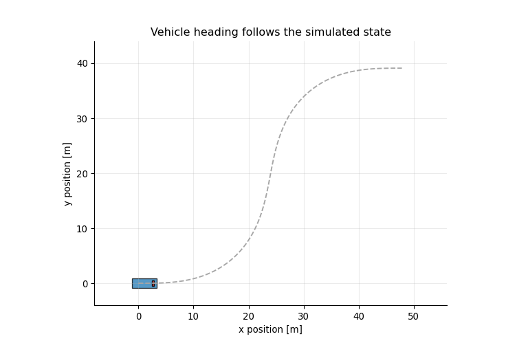

## The Core Idea

A useful model is rarely a perfect copy of the physical system. It is a deliberate approximation that preserves the mechanisms needed for the question being asked.

For many path-planning and path-tracking questions, a car-like vehicle can be simplified into two virtual wheels:

- one wheel at the center of the rear axle,
- one wheel at the center of the front axle.

That simplified vehicle is called the **bicycle model**. It is not meant to describe every detail of tire physics. It is a compact geometric model that answers a specific question:

> If a vehicle moves forward with speed `v` and front steering angle `delta`, how does its position and heading change?

This model is useful whenever the main interest is the vehicle path rather than suspension motion, tire deformation, or load transfer.

::: {.callout-note appearance="simple"}
## Learning Goals

By the end of this page, you should be able to:

1. explain why steering creates curvature rather than direct lateral motion,
2. derive the four-state kinematic bicycle equations,
3. simulate the model with a numerical integrator,
4. identify when the model is appropriate and when it is too simple.
:::

## Quick Reference

The model has four states, two inputs, and one important geometric parameter.

| Symbol | Meaning | Typical unit |
|---|---|---|
| `p_x` | longitudinal position in the world frame | m |
| `p_y` | lateral position in the world frame | m |
| `psi` | vehicle heading angle | rad |
| `v` | forward speed | m/s |
| `a` | longitudinal acceleration input | m/s^2 |
| `delta` | front steering angle input | rad |
| `L` | wheelbase | m |

The sign convention used here is standard for a planar vehicle model: positive `psi` rotates counterclockwise, and positive `delta` turns the front wheel to the left.

The state is written in the **world frame**, while `v` and `delta` are easiest to interpret in the **vehicle frame**. The equations below are the mapping between those two viewpoints.

## From Position to Velocity

Start with a point moving in a plane. Its position is `(p_x, p_y)`, its heading is `psi`, and its forward speed is `v`.

If the heading is zero, the point moves along the positive `x` direction. If the heading is positive, part of the velocity points in the lateral `y` direction.

$$
\dot p_x = v\cos(\psi), \qquad
\dot p_y = v\sin(\psi).
$$

```{python}
#| label: setup
#| include: false
from pathlib import Path

import numpy as np
import matplotlib.pyplot as plt
from matplotlib.animation import FuncAnimation, PillowWriter
from matplotlib.patches import Rectangle
from matplotlib import transforms

plt.rcParams.update({
    "figure.figsize": (8, 4.8),
    "axes.grid": True,
    "grid.alpha": 0.25,
    "axes.spines.top": False,
    "axes.spines.right": False,
})
```

```{python}
#| label: fig-point-mass-headings
#| fig-cap: "A point with fixed heading moves in a straight line. The bicycle model adds a steering law that changes this heading over time."
headings = np.deg2rad([0, 15, 30, 45])
speed = 5.0
dt = 0.1
steps = 80

fig, ax = plt.subplots()
for psi in headings:
    x = [0.0]
    y = [0.0]
    for _ in range(steps):
        x.append(x[-1] + dt * speed * np.cos(psi))
        y.append(y[-1] + dt * speed * np.sin(psi))
    ax.plot(x, y, label=f"heading = {np.rad2deg(psi):.0f} deg")

ax.set_aspect("equal", adjustable="box")
ax.set_xlabel("x position [m]")
ax.set_ylabel("y position [m]")
ax.set_title("Fixed heading gives straight-line motion")
ax.legend()
plt.show()
```

The point-mass equations explain translation, but they do not explain how the heading itself changes. For a car-like vehicle, heading changes because steering creates curvature.

## Steering Creates Curvature

Let `L` be the wheelbase and `delta` be the front steering angle.

The kinematic bicycle model is built from a no-slip rolling assumption: the rear wheel rolls in the direction of the vehicle body, and the front wheel rolls in the direction it is steered. Under that assumption, the rear-axle reference point follows an arc whose curvature is

$$
\kappa = \frac{\tan(\delta)}{L}.
$$

The heading rate is speed times curvature:

$$
\dot \psi = v\kappa = \frac{v\tan(\delta)}{L}.
$$

The turning radius is the inverse of curvature:

$$
R = \frac{1}{\kappa} = \frac{L}{\tan(\delta)}.
$$

So steering angle does not directly command lateral position. It commands curvature. The vehicle first changes heading, and lateral position changes as a consequence of moving forward with that heading.

One way to read the equation is:

$$
\text{turning rate} =
\text{forward speed} \times
\text{path curvature}.
$$

That relationship is the reason speed and steering cannot be treated as independent effects in a path simulation.

```{python}
#| label: fig-steering-geometry
#| fig-cap: "The steering angle fixes the instantaneous center of rotation. A larger steering angle reduces the turning radius."
L = 2.8
delta = np.deg2rad(22.0)
R = L / np.tan(delta)

rear = np.array([0.0, 0.0])
front = np.array([L, 0.0])
icc = np.array([0.0, R])

fig, ax = plt.subplots(figsize=(7, 5))
ax.plot([rear[0], front[0]], [rear[1], front[1]], color="tab:blue", linewidth=3, label="vehicle centerline")
ax.scatter([rear[0], front[0], icc[0]], [rear[1], front[1], icc[1]], color=["tab:blue", "tab:red", "tab:green"], zorder=3)
ax.text(rear[0] - 0.35, rear[1] - 0.35, "rear axle")
ax.text(front[0] + 0.1, front[1] - 0.35, "front axle")
ax.text(icc[0] + 0.15, icc[1], "instantaneous center")

front_wheel = front + 0.85 * np.array([np.cos(delta), np.sin(delta)])
ax.arrow(front[0], front[1], front_wheel[0] - front[0], front_wheel[1] - front[1],
         width=0.025, head_width=0.18, color="tab:red", length_includes_head=True)
ax.plot([rear[0], icc[0]], [rear[1], icc[1]], ":", color="tab:green", linewidth=2)
ax.plot([rear[0], front[0]], [rear[1] - 0.55, front[1] - 0.55], color="0.25")
ax.text(L / 2 - 0.15, -0.9, "L")
ax.text(0.15, R / 2, "R", color="tab:green")

theta = np.linspace(-np.pi / 2, -np.pi / 2 + 0.75, 80)
ax.plot(icc[0] + R * np.cos(theta), icc[1] + R * np.sin(theta),
        color="tab:orange", linewidth=2.5, label="path arc")
ax.set_aspect("equal", adjustable="box")
ax.set_xlim(-1.5, 5.0)
ax.set_ylim(-1.5, R + 1.0)
ax.set_xlabel("x [m]")
ax.set_ylabel("y [m]")
ax.set_title("Bicycle-model steering geometry")
ax.legend(loc="upper right")
plt.show()
```

```{python}
#| label: radius-table
L = 2.8
for deg in [5, 10, 20, 30]:
    delta = np.deg2rad(deg)
    radius = L / np.tan(delta)
    print(f"steering {deg:>2} deg -> turning radius {radius:5.1f} m")
```

The table is also a useful scale check. For a passenger-car wheelbase around `2.8 m`, a steering angle of `5 deg` gives a broad curve, while `30 deg` gives a tight low-speed maneuver.

## The Four-State Model

The usual kinematic bicycle state is

$$
x =
\begin{bmatrix}
p_x & p_y & \psi & v
\end{bmatrix}^{\top}.
$$

The usual control input is

$$
u =
\begin{bmatrix}
a & \delta
\end{bmatrix}^{\top},
$$

where `a` is longitudinal acceleration and `delta` is front steering angle.

Putting translation, steering geometry, and acceleration together gives

$$
\dot{p}_x = v\cos(\psi), \qquad
\dot{p}_y = v\sin(\psi), \qquad
\dot{\psi} = \frac{v\tan(\delta)}{L}, \qquad
\dot{v} = a.
$$

This is a continuous-time nonlinear state-space model:

$$
\dot{x} = f(x, u).
$$

It is nonlinear because of the trigonometric terms `cos(psi)`, `sin(psi)`, and `tan(delta)`. That nonlinearity is not decorative; it is the mathematical expression of vehicle geometry.

In Python, the model is just a short function:

```{python}
#| label: bicycle-functions
def bicycle_derivative(state, control, wheelbase=2.8):
    px, py, psi, v = state
    a, delta = control
    return np.array([
        v * np.cos(psi),
        v * np.sin(psi),
        v * np.tan(delta) / wheelbase,
        a,
    ])


def rk4_step(state, control, dt=0.1, wheelbase=2.8):
    k1 = bicycle_derivative(state, control, wheelbase)
    k2 = bicycle_derivative(state + 0.5 * dt * k1, control, wheelbase)
    k3 = bicycle_derivative(state + 0.5 * dt * k2, control, wheelbase)
    k4 = bicycle_derivative(state + dt * k3, control, wheelbase)
    return state + (dt / 6.0) * (k1 + 2 * k2 + 2 * k3 + k4)


def simulate_bicycle(initial_state, controls, dt=0.1, wheelbase=2.8):
    states = [np.array(initial_state, dtype=float)]
    state = states[0].copy()
    for control in controls:
        state = rk4_step(state, np.array(control, dtype=float), dt, wheelbase)
        states.append(state.copy())
    return np.array(states)
```

The code uses RK4 integration rather than a first-order Euler step. Euler is easier to write, but it accumulates visible error when the step size is large or the vehicle turns sharply. RK4 is still simple, and it gives a cleaner simulation for tutorial-scale examples.

## Sanity Check: Constant Steering

Before trusting any simulation, check a case with a known analytical structure. If `v` and `delta` are constant, the heading rate is constant:

$$
\dot{\psi} = \frac{v\tan(\delta)}{L}.
$$

After time `T`, the heading change should be approximately

$$
\Delta \psi = T\frac{v\tan(\delta)}{L}.
$$

```{python}
#| label: constant-steering-sanity-check
dt = 0.05
T = 4.0
steps = int(T / dt)
v = 5.0
delta = np.deg2rad(8.0)
states = simulate_bicycle([0.0, 0.0, 0.0, v], [(0.0, delta)] * steps, dt=dt, wheelbase=2.8)

predicted_heading = T * v * np.tan(delta) / 2.8
simulated_heading = states[-1, 2]

print(f"predicted heading change: {predicted_heading:.4f} rad")
print(f"simulated heading change: {simulated_heading:.4f} rad")
print(f"absolute error:           {abs(predicted_heading - simulated_heading):.2e} rad")
```

This type of check is small, but it is good modeling hygiene. It verifies that the numerical implementation agrees with the equation in a controlled situation before we use the same code for richer maneuvers.

## Constant Steering

With constant speed and constant steering, the path is a circular arc.

```{python}
#| label: fig-constant-steering-arcs
#| fig-cap: "For constant speed and constant steering angle, the kinematic bicycle model traces circular arcs."
dt = 0.1
steps = 180
initial_state = np.array([0.0, 0.0, 0.0, 6.0])

fig, ax = plt.subplots()
for steer_deg in [0, 5, 10, 20]:
    controls = [(0.0, np.deg2rad(steer_deg)) for _ in range(steps)]
    states = simulate_bicycle(initial_state, controls, dt=dt)
    ax.plot(states[:, 0], states[:, 1], label=f"delta = {steer_deg} deg")

ax.set_aspect("equal", adjustable="box")
ax.set_xlabel("x position [m]")
ax.set_ylabel("y position [m]")
ax.set_title("Constant steering creates circular arcs")
ax.legend()
plt.show()
```

The larger the steering angle, the smaller the turning radius. A longer wheelbase would have the opposite effect: it would produce a wider turn for the same steering input.

## Animation: Steering Angle Changes the Radius

The next animation sweeps steering from `0` to `25` degrees. The vehicle starts from the same state each time. As the steering angle increases, the curve tightens.

::: {#fig-turning-radius-animation}
```{=html}
<div class="bm-widget" id="radius-sweep">
  <div class="bm-controls bm-controls-compact">
    <label>Sweep playback rate
      <input id="sweep-rate" type="range" min="0.2" max="3" value="1" step="0.1">
      <output id="sweep-rate-out"></output>
    </label>
  </div>
  <canvas id="sweep-canvas" width="920" height="520" aria-label="Animation showing how steering angle changes turning radius"></canvas>
</div>
```

Increasing the steering angle tightens the path because it increases curvature and reduces turning radius. The horizontal axis is intentionally extended to `-30 m` so the full sweep remains visible.
:::

## Interactive Turning Explorer

Use the sliders to change steering angle, speed, wheelbase, and playback rate. The path is recomputed in the browser using the same kinematic equations.

::: {#fig-interactive-turning-explorer}
```{=html}
<div class="bm-widget" id="turning-explorer">
  <div class="bm-controls">
    <label>Steering angle δ [deg]
      <input id="turn-delta" type="range" min="-28" max="28" value="12" step="1">
      <output id="turn-delta-out"></output>
    </label>
    <label>Speed v [m/s]
      <input id="turn-speed" type="range" min="1" max="12" value="6" step="0.5">
      <output id="turn-speed-out"></output>
    </label>
    <label>Wheelbase L [m]
      <input id="turn-wheelbase" type="range" min="1.8" max="4.2" value="2.8" step="0.1">
      <output id="turn-wheelbase-out"></output>
    </label>
    <label>Playback rate
      <input id="turn-rate" type="range" min="0.2" max="2.5" value="1" step="0.1">
      <output id="turn-rate-out"></output>
    </label>
    <label>Simulation time [s]
      <input id="turn-time" type="number" min="2" max="300" value="16.4" step="0.1">
    </label>
    <label class="bm-check">
      <input id="turn-auto-circle" type="checkbox" checked>
      Auto one-circle time
    </label>
    <label class="bm-check">
      <input id="turn-preserve" type="checkbox">
      Preserve path when parameters change
    </label>
  </div>
  <div class="bm-toolbar">
    <button id="turn-play" type="button">Pause</button>
    <button id="turn-reset" type="button">Reset</button>
    <span id="turn-readout"></span>
  </div>
  <canvas id="turn-canvas" width="920" height="520" aria-label="Interactive bicycle model turning simulation"></canvas>
</div>
```

Interactive turning explorer. The controls can recompute a one-circle trajectory from the current parameters, or preserve the existing path and continue from the current state after parameters change.
:::

## A Smooth Steering Maneuver

Path changes usually require steering one way and then steering back. A simple sinusoidal steering input is enough to show the idea.

```{python}
#| label: fig-smooth-steering-maneuver
#| fig-cap: "A smooth steering input first builds heading, then lateral displacement. Steering is not lateral velocity."
dt = 0.1
t = np.arange(0.0, 10.0, dt)
steer = np.deg2rad(10.0) * np.sin(2.0 * np.pi * t / t[-1])
controls = [(0.0, d) for d in steer]
states = simulate_bicycle([0.0, 0.0, 0.0, 7.0], controls, dt=dt)

fig, axes = plt.subplots(1, 2, figsize=(10, 4.2))
axes[0].plot(states[:, 0], states[:, 1], color="tab:blue")
axes[0].set_aspect("equal", adjustable="box")
axes[0].set_xlabel("x position [m]")
axes[0].set_ylabel("y position [m]")
axes[0].set_title("Resulting path")

axes[1].plot(t, np.rad2deg(steer), color="tab:orange")
axes[1].set_xlabel("time [s]")
axes[1].set_ylabel("steering [deg]")
axes[1].set_title("Steering command")

fig.tight_layout()
plt.show()
```

This shows a practical modeling point: lateral displacement is delayed relative to steering input. Steering changes heading first; position follows after the vehicle has moved forward.

## Animation: A Vehicle Body Along the Path

The rectangle below is only a visual aid. The state model still tracks the rear-axle reference point, heading, and speed. Drawing a body on top of the state makes the geometry easier to read.

```{python}
#| label: make-body-animation
#| include: false
body_gif_path = Path("bicycle-body-animation-v3.gif")

if not body_gif_path.exists():
    dt = 0.1
    t = np.arange(0.0, 10.0, dt)
    steer = np.deg2rad(10.0) * np.sin(2.0 * np.pi * t / t[-1])
    states = simulate_bicycle([0.0, 0.0, 0.0, 7.0], [(0.0, d) for d in steer], dt=dt)

    fig, ax = plt.subplots(figsize=(8, 5.2))
    ax.plot(states[:, 0], states[:, 1], "--", color="0.65", linewidth=1.4)
    ax.set_xlim(-8, 56)
    ax.set_ylim(-4, 44)
    ax.set_aspect("equal", adjustable="box")
    ax.set_xlabel("x position [m]")
    ax.set_ylabel("y position [m]")
    ax.set_title("Vehicle heading follows the simulated state")

    body_length = 4.5
    body_width = 1.8
    body = Rectangle((-body_length * 0.25, -body_width / 2), body_length, body_width,
                     facecolor="tab:blue", edgecolor="black", alpha=0.75)
    front = Rectangle((body_length * 0.55, -body_width / 4), 0.35, body_width / 2,
                      facecolor="tab:red", edgecolor="black", alpha=0.9)
    ax.add_patch(body)
    ax.add_patch(front)
    trace, = ax.plot([], [], color="tab:orange", linewidth=2.2)

    frame_ids = np.linspace(0, len(states) - 1, 55).astype(int)

    def update(frame):
        idx = frame_ids[frame]
        px, py, psi, _ = states[idx]
        transform = transforms.Affine2D().rotate(psi).translate(px, py) + ax.transData
        body.set_transform(transform)
        front.set_transform(transform)
        trace.set_data(states[:idx + 1, 0], states[:idx + 1, 1])
        return body, front, trace

    animation = FuncAnimation(fig, update, frames=len(frame_ids), interval=140, blit=True)
    animation.save(body_gif_path, writer=PillowWriter(fps=8))
    plt.close(fig)
```

{#fig-vehicle-body-animation}

## Interactive Maneuver Explorer

This version lets you alter the steering waveform. Increasing the steering amplitude increases curvature; increasing the maneuver duration spreads the same left-right steering pattern over a longer time.

::: {#fig-interactive-maneuver-explorer}
```{=html}
<div class="bm-widget" id="maneuver-explorer">
  <div class="bm-controls">
    <label>Steering amplitude [deg]
      <input id="man-amp" type="range" min="0" max="20" value="10" step="1">
      <output id="man-amp-out"></output>
    </label>
    <label>Maneuver duration [s]
      <input id="man-duration" type="range" min="4" max="16" value="10" step="0.5">
      <output id="man-duration-out"></output>
    </label>
    <label>Speed v [m/s]
      <input id="man-speed" type="range" min="2" max="12" value="7" step="0.5">
      <output id="man-speed-out"></output>
    </label>
    <label>Playback rate
      <input id="man-rate" type="range" min="0.2" max="2.5" value="1" step="0.1">
      <output id="man-rate-out"></output>
    </label>
  </div>
  <div class="bm-toolbar">
    <button id="man-play" type="button">Pause</button>
    <button id="man-reset" type="button">Reset</button>
    <span id="man-readout"></span>
  </div>
  <canvas id="man-canvas" width="920" height="420" aria-label="Interactive bicycle model lane-change simulation"></canvas>
</div>
```

Interactive maneuver explorer. The controls show how steering amplitude, maneuver duration, speed, and playback rate alter a smooth left-right steering maneuver.
:::

## Speed Matters

The same steering angle gives the same geometric turning radius, but a faster vehicle moves around that radius more quickly in time.

```{python}
#| label: fig-speed-coupling
#| fig-cap: "Speed changes how quickly the vehicle moves along the same steering-induced curvature."
dt = 0.1
steps = 100
delta = np.deg2rad(12.0)

fig, ax = plt.subplots()
for speed in [3.0, 6.0, 9.0]:
    states = simulate_bicycle([0.0, 0.0, 0.0, speed], [(0.0, delta)] * steps, dt=dt)
    ax.plot(states[:, 0], states[:, 1], label=f"v = {speed:.0f} m/s")

ax.set_aspect("equal", adjustable="box")
ax.set_xlabel("x position [m]")
ax.set_ylabel("y position [m]")
ax.set_title("Same steering angle, different speeds, same time horizon")
ax.legend()
plt.show()
```

This is why speed and steering are naturally coupled in vehicle motion. If the vehicle is moving slowly, the heading evolves slowly in time. If the vehicle is moving quickly, the same steering input rotates the heading faster.

## What the Model Is Good At

The model is strongest when the vehicle is moving in a normal driving regime:

- speed is not extremely high,
- steering angles are moderate,
- tire slip is small,
- the road is approximately flat,
- the goal is to predict the path geometry.

That makes it a practical first model for reasoning about lane changes, parking maneuvers, obstacle avoidance, and path tracking. It is also easy to linearize around an operating point, which is useful when designing controllers or estimators.

In research workflows, the kinematic bicycle model often plays the role of a **baseline model**. It is simple enough to make algorithms understandable, but structured enough to preserve the geometry that point-mass models miss.

## Common Applications

The kinematic bicycle model is commonly used in:

- path tracking for car-like robots,
- parking and low-speed maneuvering studies,
- autonomous driving tutorials,
- lane-change and obstacle-avoidance simulations,
- motion planning for mobile robots,
- controller prototyping before moving to richer vehicle dynamics,
- educational notebooks where the goal is to connect geometry, simulation, and control.

The same equations can be combined with many control methods: PID-style path tracking, pure pursuit, Stanley control, LQR, nonlinear optimization, and model-based planning.

## What This Model Assumes

The kinematic bicycle model assumes:

- no lateral tire slip,
- a flat road,
- steering angle is the front wheel angle,
- speed is aligned with the vehicle body,
- actuator dynamics are ignored,
- mass, tire force, suspension, and load transfer are not modeled.

These assumptions are usually acceptable for low-to-moderate-speed geometric motion studies. They are not enough for aggressive driving, low-friction roads, or high-speed limit handling. For those cases, a **dynamic bicycle model** adds lateral velocity, yaw rate, tire stiffness, and force limits.

## From Kinematic to Dynamic Models

The kinematic model answers a geometry question: where does the vehicle go if it rolls without slip?

A dynamic bicycle model asks a different question: how do mass, inertia, tire forces, and lateral slip shape the motion? A typical dynamic model adds states such as lateral velocity and yaw rate, and it introduces parameters such as mass, yaw inertia, cornering stiffness, and tire force limits.

That extra detail is not automatically better. It is better only when the task needs it. For low-speed parking, geometric path tracking, or algorithm demonstrations, the kinematic model may be the clearer scientific instrument. For stability analysis, aggressive maneuvers, or low-friction operation, the dynamic model becomes necessary.

## Common Mistakes

Three mistakes show up often when first using this model:

1. Treating steering as lateral velocity. Steering changes curvature, not lateral position directly.
2. Forgetting units. The trigonometric functions expect `psi` and `delta` in radians.
3. Using too large a time step. A coarse step can make the path look plausible while the numerical state is noticeably wrong.

For simple experiments, start with `dt = 0.05` to `0.1` seconds and check whether reducing `dt` changes the path meaningfully.

## Related Page

This page explains the bicycle model as a standalone vehicle model. I also use the same model inside a constrained controller example here: [Constrained Nonlinear Control with CasADi](../../project/casadi-constrained-mpc/).

```{=html}
<style>
.bm-widget {
  border: 1px solid color-mix(in srgb, currentColor 18%, transparent);
  border-radius: 8px;
  padding: 1rem;
  margin: 1.25rem 0 2rem;
  background: color-mix(in srgb, Canvas 94%, currentColor 6%);
}
.bm-controls {
  display: grid;
  grid-template-columns: repeat(auto-fit, minmax(210px, 1fr));
  gap: 0.75rem 1rem;
  align-items: end;
}
.bm-controls-compact {
  grid-template-columns: minmax(220px, 360px);
}
.bm-controls label {
  display: grid;
  gap: 0.25rem;
  font-size: 0.92rem;
  line-height: 1.25;
}
.bm-controls label.bm-check {
  display: flex;
  gap: 0.45rem;
  align-items: center;
  min-height: 2.4rem;
}
.bm-controls input[type="range"] {
  width: 100%;
}
.bm-controls input[type="number"] {
  width: 100%;
  box-sizing: border-box;
  border: 1px solid color-mix(in srgb, currentColor 24%, transparent);
  border-radius: 6px;
  background: Canvas;
  color: CanvasText;
  padding: 0.35rem 0.45rem;
}
.bm-controls output {
  font-variant-numeric: tabular-nums;
  font-size: 0.85rem;
  opacity: 0.82;
}
.bm-toolbar {
  display: flex;
  flex-wrap: wrap;
  gap: 0.75rem;
  align-items: center;
  margin: 0.9rem 0 0.6rem;
}
.bm-toolbar button {
  border: 1px solid color-mix(in srgb, currentColor 24%, transparent);
  border-radius: 6px;
  background: Canvas;
  color: CanvasText;
  padding: 0.35rem 0.7rem;
}
.bm-toolbar span {
  font-variant-numeric: tabular-nums;
  font-size: 0.92rem;
}
.bm-widget canvas {
  width: 100%;
  height: auto;
  display: block;
  border-radius: 6px;
  background: #ffffff;
}
</style>

<script>
(() => {
  const degToRad = deg => deg * Math.PI / 180;

  function derivative(state, control, wheelbase) {
    const [x, y, psi, v] = state;
    const [a, delta] = control;
    return [
      v * Math.cos(psi),
      v * Math.sin(psi),
      v * Math.tan(delta) / wheelbase,
      a
    ];
  }

  function rk4Step(state, control, dt, wheelbase) {
    const add = (base, scale, k) => base.map((value, i) => value + scale * k[i]);
    const k1 = derivative(state, control, wheelbase);
    const k2 = derivative(add(state, 0.5 * dt, k1), control, wheelbase);
    const k3 = derivative(add(state, 0.5 * dt, k2), control, wheelbase);
    const k4 = derivative(add(state, dt, k3), control, wheelbase);
    return state.map((value, i) => value + dt * (k1[i] + 2 * k2[i] + 2 * k3[i] + k4[i]) / 6);
  }

  function simulate(initialState, controls, dt, wheelbase) {
    const states = [initialState.slice()];
    let state = initialState.slice();
    for (const control of controls) {
      state = rk4Step(state, control, dt, wheelbase);
      states.push(state.slice());
    }
    return states;
  }

  function boundsFor(paths, pad = 4) {
    const xs = [];
    const ys = [];
    for (const path of paths) {
      for (const p of path) {
        xs.push(p[0]);
        ys.push(p[1]);
      }
    }
    const minX = Math.min(...xs) - pad;
    const maxX = Math.max(...xs) + pad;
    const minY = Math.min(...ys) - pad;
    const maxY = Math.max(...ys) + pad;
    return { minX, maxX, minY, maxY };
  }

  function makeMapper(canvas, bounds) {
    const margin = 42;
    const sx = (canvas.width - 2 * margin) / (bounds.maxX - bounds.minX || 1);
    const sy = (canvas.height - 2 * margin) / (bounds.maxY - bounds.minY || 1);
    const s = Math.min(sx, sy);
    const ox = margin + (canvas.width - 2 * margin - s * (bounds.maxX - bounds.minX)) / 2;
    const oy = margin + (canvas.height - 2 * margin - s * (bounds.maxY - bounds.minY)) / 2;
    return {
      scale: s,
      point(x, y) {
        return [ox + (x - bounds.minX) * s, canvas.height - (oy + (y - bounds.minY) * s)];
      }
    };
  }

  function drawGrid(ctx, canvas, bounds, map) {
    ctx.clearRect(0, 0, canvas.width, canvas.height);
    ctx.fillStyle = "#ffffff";
    ctx.fillRect(0, 0, canvas.width, canvas.height);
    ctx.strokeStyle = "#e5e7eb";
    ctx.lineWidth = 1;
    const step = 10;
    const x0 = Math.ceil(bounds.minX / step) * step;
    const y0 = Math.ceil(bounds.minY / step) * step;
    for (let x = x0; x <= bounds.maxX; x += step) {
      const [px0, py0] = map.point(x, bounds.minY);
      const [px1, py1] = map.point(x, bounds.maxY);
      ctx.beginPath();
      ctx.moveTo(px0, py0);
      ctx.lineTo(px1, py1);
      ctx.stroke();
    }
    for (let y = y0; y <= bounds.maxY; y += step) {
      const [px0, py0] = map.point(bounds.minX, y);
      const [px1, py1] = map.point(bounds.maxX, y);
      ctx.beginPath();
      ctx.moveTo(px0, py0);
      ctx.lineTo(px1, py1);
      ctx.stroke();
    }
  }

  function drawPath(ctx, map, states, endIndex, color, width = 3) {
    ctx.strokeStyle = color;
    ctx.lineWidth = width;
    ctx.beginPath();
    states.slice(0, endIndex + 1).forEach((state, i) => {
      const [x, y] = map.point(state[0], state[1]);
      if (i === 0) ctx.moveTo(x, y);
      else ctx.lineTo(x, y);
    });
    ctx.stroke();
  }

  function drawVehicle(ctx, map, state, length = 4.5, width = 1.8) {
    const [x, y, psi] = state;
    const [px, py] = map.point(x, y);
    const scale = map.scale;
    ctx.save();
    ctx.translate(px, py);
    ctx.rotate(-psi);
    ctx.fillStyle = "#2563eb";
    ctx.strokeStyle = "#111827";
    ctx.lineWidth = 1.5;
    ctx.beginPath();
    ctx.rect(-0.25 * length * scale, -0.5 * width * scale, length * scale, width * scale);
    ctx.fill();
    ctx.stroke();
    ctx.fillStyle = "#ef4444";
    ctx.fillRect(0.5 * length * scale, -0.22 * width * scale, 0.35 * length * scale, 0.44 * width * scale);
    ctx.restore();
  }

  function bindOutput(input, output, suffix = "", decimals = 1) {
    const update = () => {
      output.value = `${Number(input.value).toFixed(decimals)}${suffix}`;
    };
    input.addEventListener("input", update);
    update();
  }

  function oneCircleTime(speed, delta, wheelbase) {
    const curvature = Math.tan(delta) / wheelbase;
    if (Math.abs(curvature) < 1e-5 || speed <= 0) return 20;
    return Math.min(300, Math.max(2, 2 * Math.PI / (Math.abs(curvature) * speed)));
  }

  function constantSteeringPath(initialState, delta, speed, wheelbase, dt, horizon) {
    const steps = Math.max(2, Math.round(horizon / dt));
    const start = initialState.slice();
    start[3] = speed;
    return simulate(start, Array.from({ length: steps }, () => [0, delta]), dt, wheelbase);
  }

  function setupRadiusSweep() {
    const canvas = document.getElementById("sweep-canvas");
    if (!canvas) return;
    const ctx = canvas.getContext("2d");
    const rate = document.getElementById("sweep-rate");
    bindOutput(rate, document.getElementById("sweep-rate-out"), "x", 1);

    const dt = 0.1;
    const steeringDeg = Array.from({ length: 51 }, (_, i) => 25 * i / 50);
    const paths = steeringDeg.map(deg => constantSteeringPath([0, 0, 0, 6], degToRad(deg), 6, 2.8, dt, 9));
    const bounds = { minX: -30, maxX: 72, minY: -4, maxY: 42 };
    let frame = 0;

    function draw() {
      const index = Math.floor(frame) % paths.length;
      const states = paths[index];
      const map = makeMapper(canvas, bounds);
      drawGrid(ctx, canvas, bounds, map);
      drawPath(ctx, map, states, states.length - 1, "#2563eb", 3);
      drawVehicle(ctx, map, states[states.length - 1]);
      ctx.fillStyle = "#111827";
      ctx.font = "18px system-ui, -apple-system, Segoe UI, sans-serif";
      ctx.fillText(`steering = ${steeringDeg[index].toFixed(1)} deg`, 58, 70);
      ctx.font = "14px system-ui, -apple-system, Segoe UI, sans-serif";
      ctx.fillText("x axis spans -30 m to 72 m", 58, 94);
    }

    function tick() {
      frame = (frame + 0.08 * Number(rate.value)) % paths.length;
      draw();
      window.requestAnimationFrame(tick);
    }

    draw();
    tick();
  }

  function setupTurningExplorer() {
    const canvas = document.getElementById("turn-canvas");
    if (!canvas) return;
    const ctx = canvas.getContext("2d");
    const delta = document.getElementById("turn-delta");
    const speed = document.getElementById("turn-speed");
    const wheelbase = document.getElementById("turn-wheelbase");
    const rate = document.getElementById("turn-rate");
    const simTime = document.getElementById("turn-time");
    const autoCircle = document.getElementById("turn-auto-circle");
    const preserve = document.getElementById("turn-preserve");
    const play = document.getElementById("turn-play");
    const reset = document.getElementById("turn-reset");
    const readout = document.getElementById("turn-readout");
    bindOutput(delta, document.getElementById("turn-delta-out"), " deg", 0);
    bindOutput(speed, document.getElementById("turn-speed-out"), " m/s", 1);
    bindOutput(wheelbase, document.getElementById("turn-wheelbase-out"), " m", 1);
    bindOutput(rate, document.getElementById("turn-rate-out"), "x", 1);

    let playing = true;
    let states = [[0, 0, 0, Number(speed.value)]];
    let elapsed = 0;
    let bounds = null;
    let dt = 0.06;
    let guide = [];

    function currentParams() {
      return {
        delta: degToRad(Number(delta.value)),
        speed: Number(speed.value),
        wheelbase: Number(wheelbase.value),
        horizon: Number(simTime.value)
      };
    }

    function refreshCircleTime() {
      if (!autoCircle.checked) return;
      const p = currentParams();
      simTime.value = oneCircleTime(p.speed, p.delta, p.wheelbase).toFixed(1);
    }

    function updateGuide() {
      const p = currentParams();
      const start = states[states.length - 1] || [0, 0, 0, p.speed];
      guide = constantSteeringPath(start, p.delta, p.speed, p.wheelbase, dt, Math.max(0.5, p.horizon - elapsed));
      bounds = boundsFor([states, guide], 8);
    }

    function resetSimulation() {
      refreshCircleTime();
      const p = currentParams();
      states = [[0, 0, 0, p.speed]];
      elapsed = 0;
      updateGuide();
      draw();
    }

    function draw() {
      const map = makeMapper(canvas, bounds);
      drawGrid(ctx, canvas, bounds, map);
      if (guide.length > 1) drawPath(ctx, map, guide, guide.length - 1, "#cbd5e1", 2);
      drawPath(ctx, map, states, states.length - 1, "#f97316", 3);
      drawVehicle(ctx, map, states[states.length - 1]);
      const current = states[states.length - 1];
      const p = currentParams();
      const radius = Math.abs(p.wheelbase / Math.tan(p.delta));
      readout.textContent = `t = ${elapsed.toFixed(1)} / ${p.horizon.toFixed(1)} s, psi = ${(current[2] * 180 / Math.PI).toFixed(1)} deg, R = ${Number.isFinite(radius) ? radius.toFixed(1) : "infinite"} m`;
    }

    function tick() {
      if (playing && elapsed < Number(simTime.value)) {
        const substeps = Math.max(1, Math.round(Number(rate.value)));
        for (let i = 0; i < substeps && elapsed < Number(simTime.value); i += 1) {
          const p = currentParams();
          const state = states[states.length - 1].slice();
          state[3] = p.speed;
          states.push(rk4Step(state, [0, p.delta], dt, p.wheelbase));
          elapsed += dt;
        }
        updateGuide();
        draw();
      }
      window.requestAnimationFrame(tick);
    }

    function parametersChanged() {
      if (preserve.checked) {
        refreshCircleTime();
        updateGuide();
        draw();
      } else {
        resetSimulation();
      }
    }

    [delta, speed, wheelbase].forEach(input => input.addEventListener("input", parametersChanged));
    autoCircle.addEventListener("change", parametersChanged);
    preserve.addEventListener("change", () => {
      updateGuide();
      draw();
    });
    simTime.addEventListener("input", () => {
      autoCircle.checked = false;
      updateGuide();
      draw();
    });
    rate.addEventListener("input", draw);
    play.addEventListener("click", () => {
      playing = !playing;
      play.textContent = playing ? "Pause" : "Play";
    });
    reset.addEventListener("click", () => {
      playing = true;
      play.textContent = "Pause";
      resetSimulation();
    });
    resetSimulation();
    tick();
  }

  function setupManeuverExplorer() {
    const canvas = document.getElementById("man-canvas");
    if (!canvas) return;
    const ctx = canvas.getContext("2d");
    const amp = document.getElementById("man-amp");
    const duration = document.getElementById("man-duration");
    const speed = document.getElementById("man-speed");
    const rate = document.getElementById("man-rate");
    const play = document.getElementById("man-play");
    const reset = document.getElementById("man-reset");
    const readout = document.getElementById("man-readout");
    bindOutput(amp, document.getElementById("man-amp-out"), " deg", 0);
    bindOutput(duration, document.getElementById("man-duration-out"), " s", 1);
    bindOutput(speed, document.getElementById("man-speed-out"), " m/s", 1);
    bindOutput(rate, document.getElementById("man-rate-out"), "x", 1);

    let frame = 0;
    let playing = true;
    let states = [];
    let bounds = null;
    let dt = 0.08;

    function recompute() {
      const T = Number(duration.value);
      const n = Math.max(2, Math.round(T / dt));
      const controls = Array.from({ length: n }, (_, i) => {
        const t = i * dt;
        return [0, degToRad(Number(amp.value)) * Math.sin(2 * Math.PI * t / T)];
      });
      states = simulate([0, 0, 0, Number(speed.value)], controls, dt, 2.8);
      bounds = boundsFor([states], 8);
      frame = Math.min(frame, states.length - 1);
      draw();
    }

    function draw() {
      const map = makeMapper(canvas, bounds);
      drawGrid(ctx, canvas, bounds, map);
      drawPath(ctx, map, states, states.length - 1, "#cbd5e1", 2);
      drawPath(ctx, map, states, frame, "#f97316", 3);
      drawVehicle(ctx, map, states[frame]);
      const current = states[frame];
      readout.textContent = `t = ${(frame * dt).toFixed(1)} s, y = ${current[1].toFixed(2)} m, psi = ${(current[2] * 180 / Math.PI).toFixed(1)} deg`;
    }

    function tick() {
      if (playing) {
        frame = (frame + Math.max(1, Math.round(Number(rate.value)))) % states.length;
        draw();
      }
      window.requestAnimationFrame(tick);
    }

    [amp, duration, speed].forEach(input => input.addEventListener("input", recompute));
    rate.addEventListener("input", draw);
    play.addEventListener("click", () => {
      playing = !playing;
      play.textContent = playing ? "Pause" : "Play";
    });
    reset.addEventListener("click", () => {
      frame = 0;
      playing = true;
      play.textContent = "Pause";
      draw();
    });
    recompute();
    tick();
  }

  document.addEventListener("DOMContentLoaded", () => {
    setupRadiusSweep();
    setupTurningExplorer();
    setupManeuverExplorer();
  });
})();
</script>
```
