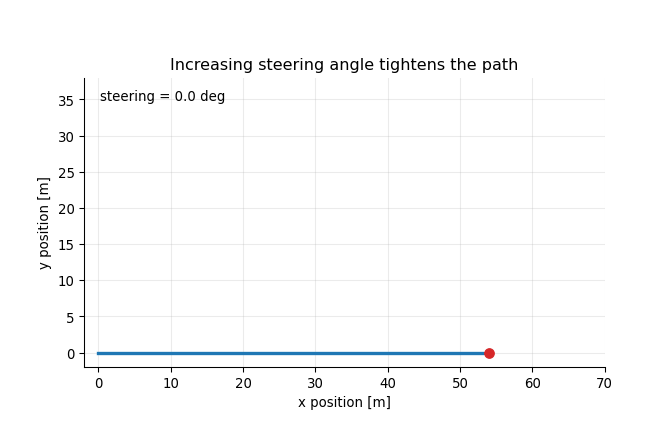
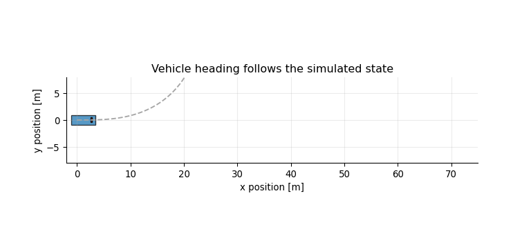

## The Core Idea

A car has four wheels, but for many path-planning and path-tracking questions we can simplify it into two virtual wheels:

- one wheel at the center of the rear axle,
- one wheel at the center of the front axle.

That simplified vehicle is called the **bicycle model**. It is not meant to describe every detail of tire physics. It is a compact geometric model that answers a more basic question:

> If a vehicle moves forward with speed `v` and front steering angle `delta`, how does its position and heading change?

This model is useful whenever the main interest is the vehicle path rather than suspension motion, tire deformation, or load transfer.

## From Position to Velocity

Start with a point moving in a plane. Its position is `(p_x, p_y)`, its heading is `psi`, and its forward speed is `v`.

If the heading is zero, the point moves along the positive `x` direction. If the heading is positive, part of the velocity points in the lateral `y` direction.

$$
\dot p_x = v\cos(\psi), \qquad
\dot p_y = v\sin(\psi).
$$

```{python}
#| label: setup
#| include: false
from pathlib import Path

import numpy as np
import matplotlib.pyplot as plt
from matplotlib.animation import FuncAnimation, PillowWriter
from matplotlib.patches import Rectangle
from matplotlib import transforms

plt.rcParams.update({
    "figure.figsize": (8, 4.8),
    "axes.grid": True,
    "grid.alpha": 0.25,
    "axes.spines.top": False,
    "axes.spines.right": False,
})
```

```{python}
#| label: point-mass-headings
headings = np.deg2rad([0, 15, 30, 45])
speed = 5.0
dt = 0.1
steps = 80

fig, ax = plt.subplots()
for psi in headings:
    x = [0.0]
    y = [0.0]
    for _ in range(steps):
        x.append(x[-1] + dt * speed * np.cos(psi))
        y.append(y[-1] + dt * speed * np.sin(psi))
    ax.plot(x, y, label=f"heading = {np.rad2deg(psi):.0f} deg")

ax.set_aspect("equal", adjustable="box")
ax.set_xlabel("x position [m]")
ax.set_ylabel("y position [m]")
ax.set_title("Fixed heading gives straight-line motion")
ax.legend()
plt.show()
```

The point-mass equations explain translation, but they do not explain how the heading itself changes. For a car-like vehicle, heading changes because steering creates curvature.

## Steering Creates Curvature

Let `L` be the wheelbase and `delta` be the front steering angle.

For a no-slip kinematic model, the path curvature is

$$
\kappa = \frac{\tan(\delta)}{L}.
$$

The heading rate is speed times curvature:

$$
\dot \psi = v\kappa = \frac{v\tan(\delta)}{L}.
$$

The turning radius is the inverse of curvature:

$$
R = \frac{1}{\kappa} = \frac{L}{\tan(\delta)}.
$$

So steering angle does not directly command lateral position. It commands curvature. The vehicle first changes heading, and lateral position changes as a consequence of moving forward with that heading.

```{python}
#| label: radius-table
L = 2.8
for deg in [5, 10, 20, 30]:
    delta = np.deg2rad(deg)
    radius = L / np.tan(delta)
    print(f"steering {deg:>2} deg -> turning radius {radius:5.1f} m")
```

## The Four-State Model

The usual kinematic bicycle state is

$$
x =
\begin{bmatrix}
p_x & p_y & \psi & v
\end{bmatrix}^{\top}.
$$

The usual control input is

$$
u =
\begin{bmatrix}
a & \delta
\end{bmatrix}^{\top},
$$

where `a` is longitudinal acceleration and `delta` is front steering angle.

Putting translation, steering geometry, and acceleration together gives

$$
\dot{p}_x = v\cos(\psi), \qquad
\dot{p}_y = v\sin(\psi), \qquad
\dot{\psi} = \frac{v\tan(\delta)}{L}, \qquad
\dot{v} = a.
$$

In Python, the model is just a short function:

```{python}
#| label: bicycle-functions
def bicycle_derivative(state, control, wheelbase=2.8):
    px, py, psi, v = state
    a, delta = control
    return np.array([
        v * np.cos(psi),
        v * np.sin(psi),
        v * np.tan(delta) / wheelbase,
        a,
    ])


def rk4_step(state, control, dt=0.1, wheelbase=2.8):
    k1 = bicycle_derivative(state, control, wheelbase)
    k2 = bicycle_derivative(state + 0.5 * dt * k1, control, wheelbase)
    k3 = bicycle_derivative(state + 0.5 * dt * k2, control, wheelbase)
    k4 = bicycle_derivative(state + dt * k3, control, wheelbase)
    return state + (dt / 6.0) * (k1 + 2 * k2 + 2 * k3 + k4)


def simulate_bicycle(initial_state, controls, dt=0.1, wheelbase=2.8):
    states = [np.array(initial_state, dtype=float)]
    state = states[0].copy()
    for control in controls:
        state = rk4_step(state, np.array(control, dtype=float), dt, wheelbase)
        states.append(state.copy())
    return np.array(states)
```

## Constant Steering

With constant speed and constant steering, the path is a circular arc.

```{python}
#| label: constant-steering
dt = 0.1
steps = 180
initial_state = np.array([0.0, 0.0, 0.0, 6.0])

fig, ax = plt.subplots()
for steer_deg in [0, 5, 10, 20]:
    controls = [(0.0, np.deg2rad(steer_deg)) for _ in range(steps)]
    states = simulate_bicycle(initial_state, controls, dt=dt)
    ax.plot(states[:, 0], states[:, 1], label=f"delta = {steer_deg} deg")

ax.set_aspect("equal", adjustable="box")
ax.set_xlabel("x position [m]")
ax.set_ylabel("y position [m]")
ax.set_title("Constant steering creates circular arcs")
ax.legend()
plt.show()
```

The larger the steering angle, the smaller the turning radius. A longer wheelbase would have the opposite effect: it would produce a wider turn for the same steering input.

## Animation: Steering Angle Changes the Radius

The next animation sweeps steering from `0` to `25` degrees. The vehicle starts from the same state each time. As the steering angle increases, the curve tightens.

```{python}
#| label: make-turning-radius-animation
#| include: false
gif_path = Path("turning-radius-animation.gif")

if not gif_path.exists():
    steer_values = np.deg2rad(np.linspace(0.0, 25.0, 36))
    fig, ax = plt.subplots(figsize=(7, 4.6))
    ax.set_xlim(-2, 70)
    ax.set_ylim(-2, 38)
    ax.set_aspect("equal", adjustable="box")
    ax.set_xlabel("x position [m]")
    ax.set_ylabel("y position [m]")
    ax.set_title("Increasing steering angle tightens the path")
    path_line, = ax.plot([], [], color="tab:blue", linewidth=2.5)
    vehicle_dot, = ax.plot([], [], "o", color="tab:red", markersize=7)
    label = ax.text(0.03, 0.92, "", transform=ax.transAxes)

    def update(frame):
        delta = steer_values[frame]
        controls = [(0.0, delta)] * 90
        states = simulate_bicycle([0.0, 0.0, 0.0, 6.0], controls, dt=0.1)
        path_line.set_data(states[:, 0], states[:, 1])
        vehicle_dot.set_data([states[-1, 0]], [states[-1, 1]])
        label.set_text(f"steering = {np.rad2deg(delta):.1f} deg")
        return path_line, vehicle_dot, label

    animation = FuncAnimation(fig, update, frames=len(steer_values), interval=90, blit=True)
    animation.save(gif_path, writer=PillowWriter(fps=12))
    plt.close(fig)
```



## A Smooth Steering Maneuver

Path changes usually require steering one way and then steering back. A simple sinusoidal steering input is enough to show the idea.

```{python}
#| label: lane-change-command
dt = 0.1
t = np.arange(0.0, 10.0, dt)
steer = np.deg2rad(10.0) * np.sin(2.0 * np.pi * t / t[-1])
controls = [(0.0, d) for d in steer]
states = simulate_bicycle([0.0, 0.0, 0.0, 7.0], controls, dt=dt)

fig, axes = plt.subplots(1, 2, figsize=(10, 4.2))
axes[0].plot(states[:, 0], states[:, 1], color="tab:blue")
axes[0].set_aspect("equal", adjustable="box")
axes[0].set_xlabel("x position [m]")
axes[0].set_ylabel("y position [m]")
axes[0].set_title("Resulting path")

axes[1].plot(t, np.rad2deg(steer), color="tab:orange")
axes[1].set_xlabel("time [s]")
axes[1].set_ylabel("steering [deg]")
axes[1].set_title("Steering command")

fig.tight_layout()
plt.show()
```

This shows a practical modeling point: lateral displacement is delayed relative to steering input. Steering changes heading first; position follows after the vehicle has moved forward.

## Animation: A Vehicle Body Along the Path

The rectangle below is only a visual aid. The state model still tracks the rear-axle reference point, heading, and speed. Drawing a body on top of the state makes the geometry easier to read.

```{python}
#| label: make-body-animation
#| include: false
body_gif_path = Path("bicycle-body-animation.gif")

if not body_gif_path.exists():
    dt = 0.1
    t = np.arange(0.0, 10.0, dt)
    steer = np.deg2rad(10.0) * np.sin(2.0 * np.pi * t / t[-1])
    states = simulate_bicycle([0.0, 0.0, 0.0, 7.0], [(0.0, d) for d in steer], dt=dt)

    fig, ax = plt.subplots(figsize=(8, 3.6))
    ax.plot(states[:, 0], states[:, 1], "--", color="0.65", linewidth=1.4)
    ax.set_xlim(-2, 75)
    ax.set_ylim(-8, 8)
    ax.set_aspect("equal", adjustable="box")
    ax.set_xlabel("x position [m]")
    ax.set_ylabel("y position [m]")
    ax.set_title("Vehicle heading follows the simulated state")

    body_length = 4.5
    body_width = 1.8
    body = Rectangle((-body_length * 0.25, -body_width / 2), body_length, body_width,
                     facecolor="tab:blue", edgecolor="black", alpha=0.75)
    front = Rectangle((body_length * 0.55, -body_width / 4), 0.35, body_width / 2,
                      facecolor="tab:red", edgecolor="black", alpha=0.9)
    ax.add_patch(body)
    ax.add_patch(front)
    trace, = ax.plot([], [], color="tab:orange", linewidth=2.2)

    frame_ids = np.linspace(0, len(states) - 1, 55).astype(int)

    def update(frame):
        idx = frame_ids[frame]
        px, py, psi, _ = states[idx]
        transform = transforms.Affine2D().rotate(psi).translate(px, py) + ax.transData
        body.set_transform(transform)
        front.set_transform(transform)
        trace.set_data(states[:idx + 1, 0], states[:idx + 1, 1])
        return body, front, trace

    animation = FuncAnimation(fig, update, frames=len(frame_ids), interval=90, blit=True)
    animation.save(body_gif_path, writer=PillowWriter(fps=12))
    plt.close(fig)
```



## Speed Matters

The same steering angle gives the same geometric turning radius, but a faster vehicle moves around that radius more quickly in time.

```{python}
#| label: speed-coupling
dt = 0.1
steps = 100
delta = np.deg2rad(12.0)

fig, ax = plt.subplots()
for speed in [3.0, 6.0, 9.0]:
    states = simulate_bicycle([0.0, 0.0, 0.0, speed], [(0.0, delta)] * steps, dt=dt)
    ax.plot(states[:, 0], states[:, 1], label=f"v = {speed:.0f} m/s")

ax.set_aspect("equal", adjustable="box")
ax.set_xlabel("x position [m]")
ax.set_ylabel("y position [m]")
ax.set_title("Same steering angle, different speeds, same time horizon")
ax.legend()
plt.show()
```

This is why speed and steering are naturally coupled in vehicle motion. If the vehicle is moving slowly, the heading evolves slowly in time. If the vehicle is moving quickly, the same steering input rotates the heading faster.

## Common Applications

The kinematic bicycle model is commonly used in:

- path tracking for car-like robots,
- parking and low-speed maneuvering studies,
- autonomous driving tutorials,
- lane-change and obstacle-avoidance simulations,
- motion planning for mobile robots,
- controller prototyping before moving to richer vehicle dynamics,
- train-control analogies where geometric path following is separated from longitudinal speed planning.

The same equations can be combined with many control methods: PID-style path tracking, pure pursuit, Stanley control, LQR, nonlinear optimization, and model-based planning.

## What This Model Assumes

The kinematic bicycle model assumes:

- no lateral tire slip,
- a flat road,
- steering angle is the front wheel angle,
- speed is aligned with the vehicle body,
- actuator dynamics are ignored,
- mass, tire force, suspension, and load transfer are not modeled.

These assumptions are usually acceptable for low-to-moderate-speed geometric motion studies. They are not enough for aggressive driving, low-friction roads, or high-speed limit handling. For those cases, a **dynamic bicycle model** adds lateral velocity, yaw rate, tire stiffness, and force limits.

## Related Page

This page explains the bicycle model as a standalone vehicle model. I also use the same model inside a constrained controller example here: [Constrained Nonlinear Control with CasADi](../../project/casadi-constrained-mpc/).
