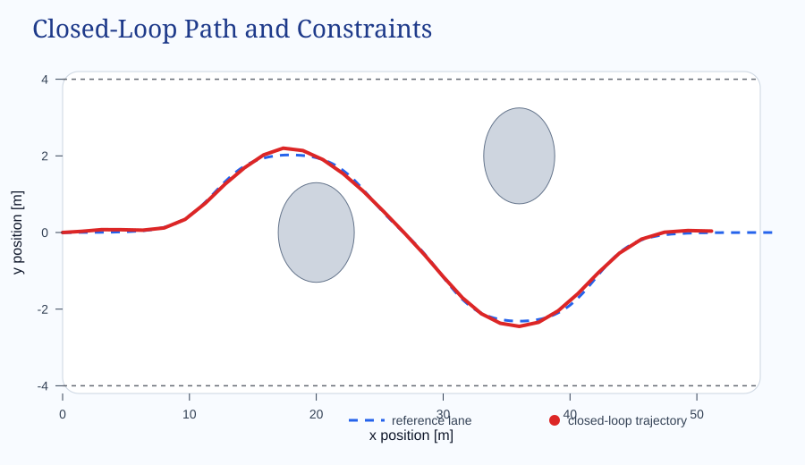
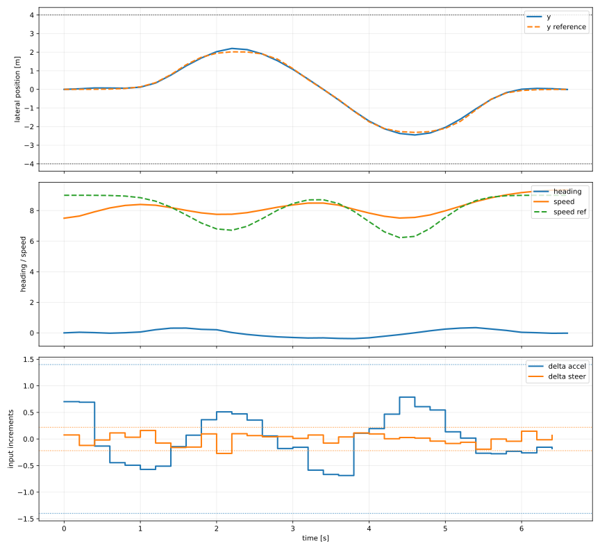

::: {.mind-motion-article}

::: {.hero-panel}
# Why This Example Matters

Model predictive control is attractive because it turns "what should I do next?" into an optimization problem with a preview of the future. That preview is exactly what makes MPC useful when you care about **competing objectives** and **hard limits** at the same time.

The example on this page is deliberately more realistic than the textbook one-state regulator. The controller must steer a vehicle-like system along a curved lane, adapt its speed to the road ahead, stay within road boundaries, and avoid two obstacles. The optimization is solved with **CasADi** and **IPOPT** at every sampling instant.
:::

::: {.key-points}
::: {.key-card}
## Problem

Control a nonlinear kinematic bicycle model with bounded acceleration and steering while following a position-dependent path and speed reference.
:::

::: {.key-card}
## Goal

Show how MPC uses a prediction horizon and constraints to choose the next control move, then repeats that process after the system advances one step.
:::

::: {.key-card}
## Main Idea

Only the **first** input from the optimized sequence is applied. Then the horizon shifts forward, the state is measured again, and the optimization is solved again.
:::
:::

## The Control Problem

The state is

$$
x_k = \begin{bmatrix} p_x & p_y & \psi & v \end{bmatrix}^\top
$$

where `p_x` and `p_y` are the vehicle position, `\psi` is the heading angle, and `v` is the speed. The control input is

$$
u_k = \begin{bmatrix} a & \delta \end{bmatrix}^\top
$$

with longitudinal acceleration `a` and steering angle `\delta`.

The controller must satisfy several constraints at once:

1. Keep the vehicle inside the road corridor.
2. Respect speed, acceleration, and steering limits.
3. Limit how quickly acceleration and steering can change.
4. Avoid obstacle regions modeled as ellipses.
5. Track a moving target lane and a varying speed reference.

This is exactly the kind of situation where MPC is worth the computational effort: the best control action depends on what will happen **several steps into the future**, not just on the current tracking error.

## MPC in Plain Language

At every sample time, MPC does the following:

1. Predict how the system will evolve over a horizon of `N` future steps.
2. Search for the control sequence that minimizes a cost function.
3. Reject any candidate sequence that violates the model constraints.
4. Apply only the first control move.
5. Measure the new state and solve the problem again.

That repeated solve-and-shift pattern is called the **receding horizon** principle.

::: {.callout-note appearance="simple"}
## Pedagogical Picture

Think of MPC as steering by repeatedly asking:

"If I commit to a sequence of actions for the next few seconds, which sequence keeps me safe, smooth, and close to the goal?"

The answer changes every time the state changes, so the optimization is repeated online.
:::

## The Scenario Geometry

The reference path is not a straight line. It uses two smooth lateral shifts built from hyperbolic tangent functions, and the speed reference slows down near the obstacle zones. Those choices make the problem nontrivial without making the model visually confusing.

```python
def reference_lane(x):
    term_1 = 2.1 * 0.5 * (np.tanh((x - 12.0) / 3.0) - np.tanh((x - 24.0) / 3.0))
    term_2 = 2.4 * 0.5 * (np.tanh((x - 30.0) / 3.0) - np.tanh((x - 42.0) / 3.0))
    return term_1 - term_2

def reference_speed(x):
    slowdown_1 = 2.3 * np.exp(-((x - 17.0) / 5.5) ** 2)
    slowdown_2 = 2.8 * np.exp(-((x - 35.0) / 5.0) ** 2)
    return 9.0 - slowdown_1 - slowdown_2

def obstacle_ellipses():
    return [
        Obstacle(x=20.0, y=0.0, rx=3.0, ry=1.3),
        Obstacle(x=36.0, y=2.0, rx=2.8, ry=1.25),
    ]
```

The reference lane bends twice, and the speed reference decreases near the obstacle-rich regions. This forces the controller to balance path-following against smooth input changes and collision avoidance.



The top-left panel is the most important geometric picture. The vehicle trajectory bends around the obstacle ellipses while staying within the road corridor. That is the visible consequence of the optimization problem.

## The Prediction Model

The controller uses a **kinematic bicycle model**, a common reduced-order model for path tracking:

$$
\dot{p}_x = v\cos(\psi), \qquad
\dot{p}_y = v\sin(\psi), \qquad
\dot{\psi} = \frac{v\tan(\delta)}{L}, \qquad
\dot{v} = a
$$

where `L` is the wheelbase.

In the Python program, the continuous dynamics are integrated with an RK4 step:

```python
def _dynamics(self, x, u):
    px, py, psi, v = x[0], x[1], x[2], x[3]
    a, delta = u[0], u[1]
    return ca.vertcat(
        v * ca.cos(psi),
        v * ca.sin(psi),
        v * ca.tan(delta) / self.cfg.wheelbase,
        a,
    )

def _rk4_step(self, x, u):
    dt = self.cfg.dt
    k1 = self._dynamics(x, u)
    k2 = self._dynamics(x + 0.5 * dt * k1, u)
    k3 = self._dynamics(x + 0.5 * dt * k2, u)
    k4 = self._dynamics(x + dt * k3, u)
    return x + (dt / 6.0) * (k1 + 2 * k2 + 2 * k3 + k4)
```

This is an important modeling decision. A crude Euler step would still work for a demo, but RK4 makes the prediction model more faithful without making the code much harder to read.

## The Optimization Problem

Over the horizon, the controller penalizes:

1. Lateral path-tracking error.
2. Heading error relative to the path direction.
3. Speed-tracking error.
4. Large control effort.
5. Large changes in acceleration and steering.
6. Constraint slack variables when the nonlinear problem needs a soft safety margin.

The heart of the nonlinear program looks like this:

```python
tracking_error = ca.vertcat(
    xk[0],
    xk[1] - y_ref,
    xk[2] - psi_ref,
    xk[3] - v_ref,
)
obj += (
    w_y * tracking_error[1] ** 2
    + w_psi * tracking_error[2] ** 2
    + w_v * tracking_error[3] ** 2
    + ca.mtimes([uk.T, w_u, uk])
    - progress_reward * xk[3]
)

du = uk - (u_prev if k == 0 else U[:, k - 1])
obj += ca.mtimes([du.T, w_du, du])
```

Notice the `du` term. That is where "smooth control" enters the problem. Without it, the optimizer would often choose much sharper changes in acceleration and steering because they reduce tracking error faster in the short term.

### How the Constraints Enter

The state and input bounds are represented as optimization constraints. Obstacle avoidance is enforced with ellipse inequalities, and road/rate limits are softened through slack variables with heavy penalties:

```python
g.append(xk[1] - R[0, k])
lbg.append(-ca.inf)
ubg.append(self.cfg.road_half_width)

g.append(du[1] - D[1, k])
lbg.append(-ca.inf)
ubg.append(self.cfg.steer_rate_limit)

normalized_distance = ((xk[0] - obstacle.x) / obstacle.rx) ** 2 + (
    (xk[1] - obstacle.y) / obstacle.ry
) ** 2
g.append(normalized_distance + S[obs_index, k])
lbg.append(1.0)
ubg.append(ca.inf)
```

For the obstacle constraint, the normalized squared distance must stay **above 1**. If it drops below `1`, the predicted state is inside the obstacle ellipse. The slack `S` allows the solver to stay numerically robust, but the penalty is strong enough that the optimizer avoids using slack unless it really has to.

## The Receding-Horizon Loop

Once the nonlinear program is built, the closed-loop controller is just a repeated cycle of:

1. solve,
2. apply the first input,
3. propagate the state,
4. shift the initial guess.

That pattern appears directly in the simulation loop:

```python
for step in range(cfg.steps):
    solution, predicted_controls, predicted_states, cost = controller.solve(x, u_prev, guess)
    u = predicted_controls[:, 0]
    x = controller.rollout(x, u)

    states.append(x.copy())
    controls.append(u.copy())
    costs.append(cost)

    u_prev = u
    guess = controller.shift_guess(solution)
```

This is the conceptual core of MPC. The optimizer computes a whole plan, but the controller trusts only the **first** move because new state information will be available immediately afterward.

## Reading the Results



The second figure helps interpret the controller behavior:

1. The lateral position follows the lane shifts without touching the road boundaries.
2. The speed adapts to the varying reference instead of trying to stay constant.
3. The increments in acceleration and steering remain moderate, which means the smoothing terms are doing real work.

From the verified run used for this article:

1. Final longitudinal position: about `51.15 m`
2. Maximum lateral excursion: about `2.45 m`
3. Maximum speed: about `9.33 m/s`
4. Maximum steering angle magnitude: about `0.319 rad`
5. Minimum obstacle margin: about `0.89`

Those numbers matter because they show the controller is not merely producing a pretty path. It is doing so while staying well inside the actuator limits and maintaining a positive clearance from the obstacle boundaries.

## What This Example Teaches

This example illustrates three practical lessons about MPC:

1. **Prediction matters.** The controller begins steering before a collision or road-edge violation is imminent because it can see the future over the horizon.
2. **Weights matter.** Tracking, effort, and smoothness are all negotiable; changing the weights changes the controller personality.
3. **Constraints matter.** The interesting behavior is caused by the constraints, not despite them.

For a classroom or self-study setting, this is a useful middle ground between a toy regulator and a full dynamic vehicle model. The ideas stay readable, but the optimization problem is already rich enough to feel like real control engineering.

## Run the Code

The full working source used for this page is bundled with the article:

- [Python controller source](assets/code/mpc_bicycle_constraints.py)
- [Closed-loop results CSV](assets/code/closed_loop_results.csv)

To run the example locally in the original project folder:

```bash
conda activate control
cd /Users/kirar2004/Documents/Coding/Python/casadi_mpc_constraints
python mpc_bicycle_constraints.py
```

That generates the figures used on this page and saves them under `outputs/`.

:::
